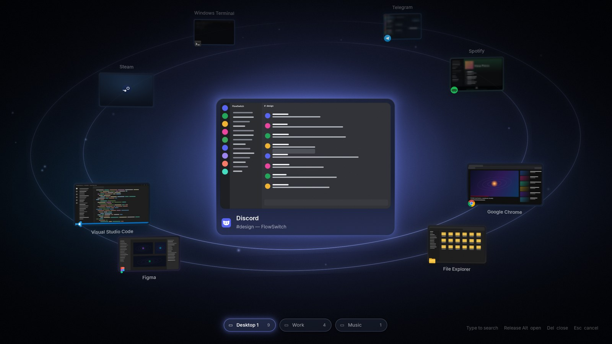
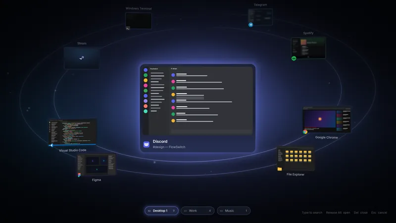
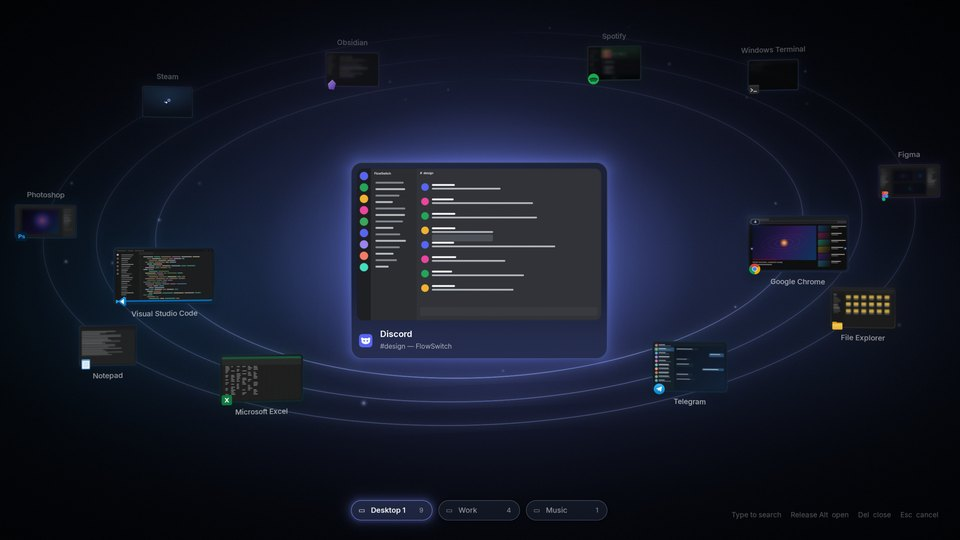
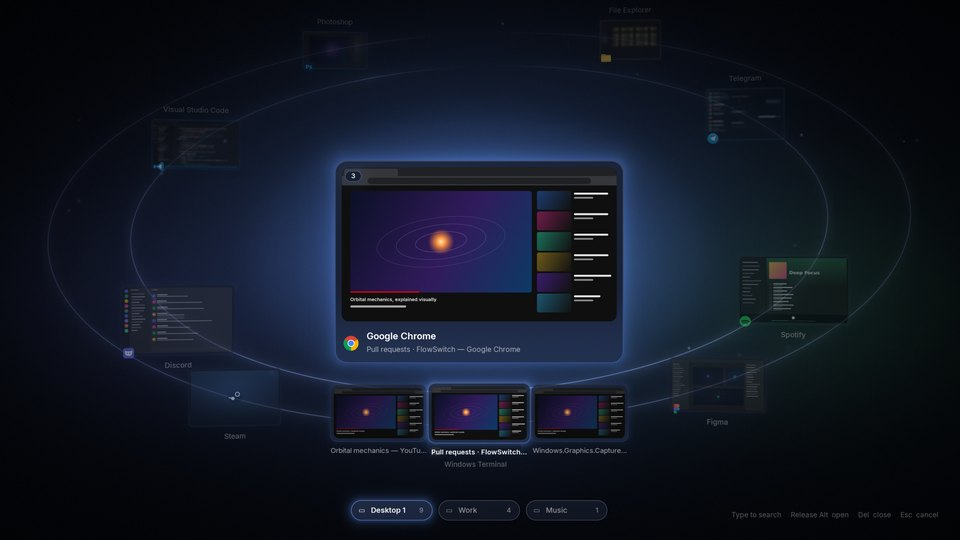
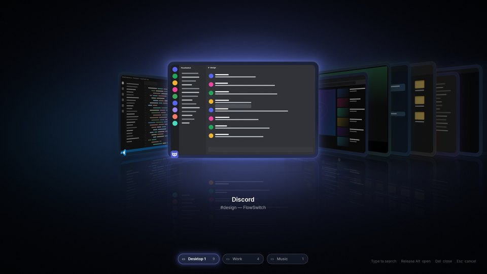
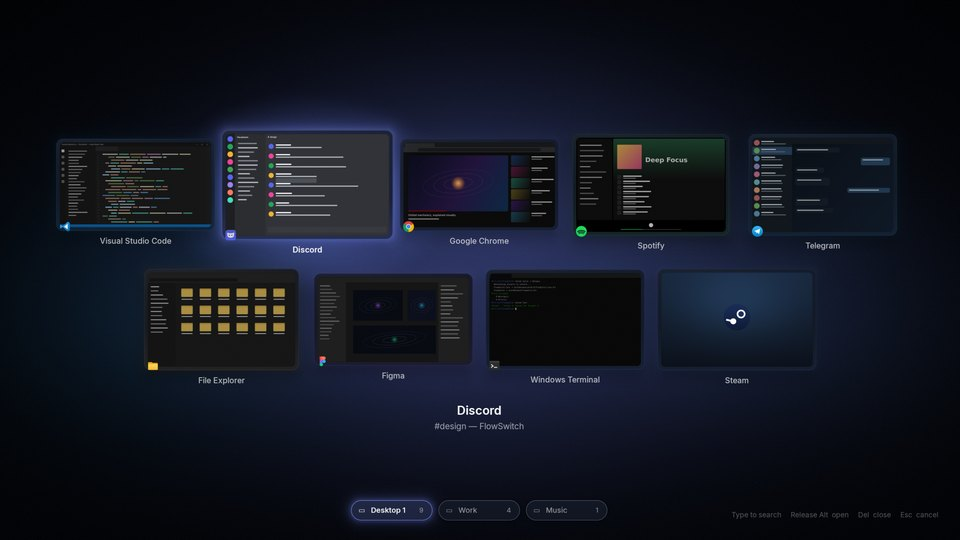

<p align="center">
  
</p>

<h1 align="center">FlowSwitch</h1>
<p align="center"><b>Your windows. In motion.</b><br/>A premium replacement for the Windows 11 Alt + Tab experience.</p>

<p align="center">
  
</p>

Press <kbd>Alt</kbd> + <kbd>Tab</kbd> and the desktop dims behind a soft blur. The window you are
about to switch to floats in the middle as a large live preview; every other window travels on
thin elliptical orbits around it, smaller, darker and softer the farther back it sits. Each app
glows in its own color, and that color becomes the ambient light of the whole scene. Tab turns
the system; quick presses pile up into one accelerating rotation that settles softly. Release
<kbd>Alt</kbd> and the card flies into the real window.

FlowSwitch changes how Alt + Tab **looks**, never what it **does**: window order, activation and
focus behave exactly as in Windows. If anything ever goes wrong, Windows' own Alt + Tab takes over
by itself.

<p align="center">
  <br/>
  <sub>Four quick Tab presses: one accelerating rotation, the ambient light following each app.</sub>
</p>

## Highlights

- **Solar System** — the selected window at the center, the rest on one to four orbits
  (automatic by window count), true perspective depth, per-app glow and ambient light, depth of
  field, idle drift you feel more than see.
- **Motion that never makes you wait** — everything is a critically damped spring. A tap of
  Alt + Tab switches instantly (with a brief trace of light on the target); holding Alt reveals
  the overlay; holding a little longer (≈450 ms) expands it with names, search and desktops.
- **Live previews** — Windows.Graphics.Capture with tiered refresh: the selected window every
  frame, neighbors ~30 fps, distant windows 8–15 fps or a still.
- **More layouts** — Orbit Minimal, Carousel, Grid and Cover Flow.
- **Window size** — size the selected window (80–180 %) and the others (50–150 %) separately, or pick
  Compact, Default, Large or Huge. Orbits, rows and grids re-plan around the new size so nothing
  overlaps or leaves the screen; text stays comfortably sized; changes glide in live.
- **Type to search** — by app, window title or program name; works even when you type in the
  wrong keyboard layout (`вшыс` — “disc” typed on a Russian layout — finds Discord).
- **Groups** — many windows of one app become a planet with satellites that unfold on dwell,
  with <kbd>`</kbd> or the arrow keys.
- **Mouse** — hover lifts and tilts a card, click opens, wheel rotates, close and pin buttons.
- **Virtual desktops** — a quiet strip in the expanded view; click to switch.
- **Multi-monitor** — show on the active window's monitor, the mouse's, or all monitors.
- **Fail-safe by construction** — see [Reliability](#reliability).
- **Refresh-rate native** — renders at 60/120/144/240 Hz, uses no GPU at all while closed.
- **Settings app** — a separate Mica window with a live, engine-accurate preview of every option,
  presets for motion (Smooth, Snappy, Cinematic, Minimal, Custom) and quality (Battery Saver,
  Balanced, High, Ultra, Auto), reduced motion, hotkeys and a first-run tour.

| | |
|---|---|
|  |  |
|  |  |

<sub>These images are produced by the design preview pipeline from the engine's real display lists
and shaders (see [docs/DESIGN.md](docs/DESIGN.md)); window contents are drawn stand-ins.</sub>

## Requirements

- Windows 10 version 2004 (build 19041) or later; designed for Windows 11 (Mica, rounded corners,
  Snap Layouts in Settings).
- [.NET 10 Desktop Runtime](https://dotnet.microsoft.com/download/dotnet/10.0) (or publish
  self-contained, below).
- A Direct3D 11 GPU (feature level 10.0+). Live previews need Windows.Graphics.Capture, which every
  supported Windows version has.

## Build and run

```powershell
git clone https://github.com/pumpumGiorno/FlowSwitch
cd FlowSwitch
dotnet build -c Release
dotnet run --project src/FlowSwitch -c Release
```

The resident app (`FlowSwitch.exe`) lives in the notification area. Right-click its icon for
**Open Settings**, **Preview switcher**, **Enable**, **Pause for 1 hour**, **Restart** and
**Exit**. The first start opens the welcome tour.

To produce a folder you can copy to another PC:

```powershell
./build/publish.ps1                 # framework-dependent, → artifacts/FlowSwitch
./build/publish.ps1 -SelfContained  # includes the .NET runtime
```

Run the tests with `dotnet test`.

## Using it

| Keys | Action |
|---|---|
| <kbd>Alt</kbd> + <kbd>Tab</kbd> | Open / move forward. A quick tap switches instantly. |
| <kbd>Alt</kbd> + <kbd>Shift</kbd> + <kbd>Tab</kbd> | Move backwards |
| <kbd>Ctrl</kbd> + <kbd>Alt</kbd> + <kbd>Tab</kbd> | Switcher that stays open after Alt is released |
| <kbd>Alt</kbd> + <kbd>`</kbd> | Windows of the current app / step through a group |
| Release <kbd>Alt</kbd>, <kbd>Enter</kbd> | Open the selected window |
| <kbd>Esc</kbd> | Cancel (the system rewinds) |
| <kbd>←</kbd> <kbd>→</kbd> / <kbd>↑</kbd> <kbd>↓</kbd> | Rotate / step through a group's windows |
| <kbd>Home</kbd> <kbd>End</kbd> | First / last window |
| Type | Search; <kbd>Backspace</kbd> edits |
| <kbd>Ctrl</kbd> + <kbd>W</kbd>, <kbd>Delete</kbd> | Close the selected window |
| <kbd>Ctrl</kbd> + <kbd>P</kbd> | Pin the selected window to the front |

The opening shortcuts, closing, arrows and the mouse wheel can each be turned off in
**Settings → Hotkeys**; type-to-search in **Settings → General**.

## Reliability

Replacing Alt + Tab is only acceptable if you can never lose it. FlowSwitch is built so that the
worst case is "Windows' own Alt + Tab appears":

- The keyboard hook runs on its own high-priority thread and only classifies keys; it never waits
  for the UI, so Windows never has a reason to drop it.
- After swallowing Tab, the overlay must acknowledge within **150 ms** (configurable). Otherwise the
  keystroke is replayed and the native switcher opens — on that very press.
- A render-loop heartbeat is checked every 100 ms; if the UI stalls for 0.7 s the keyboard is given
  back immediately.
- Alt is never swallowed, so Windows always knows the real modifier state; an unassigned key keeps
  apps from opening their menu bar.
- If the process dies, Windows removes the hook — native Alt + Tab is back. A watchdog restarts a
  hung or crashed FlowSwitch; after repeated crashes it starts in **safe mode** (hook off) and
  tells you why.
- Exclusive fullscreen games, the secure desktop (UAC, Ctrl + Alt + Del, lock screen) and any apps
  you list keep the native switcher.

Details: [docs/ARCHITECTURE.md](docs/ARCHITECTURE.md).

## Known limits

- **Elevated windows.** A normal (non-admin) process cannot see keystrokes while an administrator
  window is in front (Windows' UIPI). FlowSwitch then simply lets Windows handle Alt + Tab. To
  cover those windows too, enable **Settings → Advanced → Run with administrator rights** (a
  scheduled task starts FlowSwitch elevated at sign-in).
- **Win + Tab / Task View** is not replaced — it is a different feature with its own gestures.
- Preview capture can't see protected content (DRM video, some password prompts); those previews
  stay dark, as they do in Windows' own switcher.

## Repository

```
src/FlowSwitch.Core       Platform-free engine: springs, layouts, session logic, scene composition, settings
src/FlowSwitch            Resident Windows app: hook, window tracking, capture, D3D11/DirectComposition renderer
src/FlowSwitch.Settings   WPF Settings app and onboarding (separate process)
tests/                    Engine unit tests (layout no-overlap properties, motion continuity, session rules…)
tools/ScenePreview        Runs the engine headlessly and dumps display lists
tools/web-preview         Renders those display lists with the real HLSL (cross-compiled) for design review
tools/icon                Logo and icon generator
docs/                     Architecture, motion language, design notes
```

## Documentation

- [Architecture](docs/ARCHITECTURE.md) — how Alt + Tab can (and cannot) be replaced, threads,
  rendering, capture, fail-safe.
- [Motion](docs/MOTION.md) — the animation language: springs, tokens, presets, reduced motion.
- [Design](docs/DESIGN.md) — visual language, the Solar System layout, and the preview pipeline.
