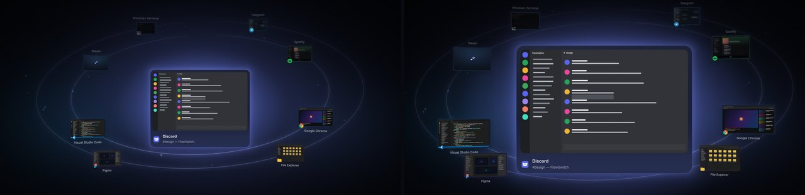

# Design

## Principles

- **Minimal, expensive, quiet.** Deep graphite and night-blue, glass, soft light. No neon, no RGB, no
  gamer chrome. The only saturated color on screen belongs to the apps themselves.
- **Hierarchy through light and depth, not decoration.** The selected window is the brightest,
  sharpest, largest thing; everything else recedes — smaller, darker, softer.
- **Readable at a glance.** App name and window title are always legible within ~0.2 s of a card
  arriving. Labels never collide with cards, and nothing ever covers the selected window.
- **Motion carries meaning.** See [MOTION.md](MOTION.md).

## Visual language

| Element | Treatment |
|---|---|
| Backdrop | The live desktop, blurred (animatable radius) and dimmed toward `#070A12`; OLED theme goes to true black; *Auto* adapts dimming to the desktop's brightness. Subtle film grain and dithering prevent banding. |
| Glass card | `#131826` glass at 80 % over the frosted backdrop, 22 px corners (design units), a thin edge light brighter at the top, a soft contact shadow, faint light from below. |
| Selected card | Full size, live preview at the highest refresh, info strip (icon, app name in Segoe UI Variable Display Semibold, window title in Text), 1–2 % breathing, bloom in the app's color. |
| Glow | Per app, from a known-color table or the icon's dominant hue, normalised in OKLab (lightness 0.64–0.80, chroma 0.08–0.17) and perceptually gain-corrected so yellow never shouts and violet never disappears. |
| Ambient light | A large, very soft wash of the selected app's color behind the system; neighbours tint its edges. Cross-fades in OKLab over ~230 ms. |
| Orbits | Hairline ellipses (about one design unit) with a faint halo, tinted by the ambient color and brightening slightly with rotation speed; a few specks of light drift along them. |
| Depth | Scale, brightness and depth-of-field blur by distance; true perspective for yaw/pitch. |
| Typography | Segoe UI Variable Display for names and titles, Text for body, Small for hints; Segoe Fluent Icons for glyphs. |
| Fallback card | Minimised or uncapturable windows: the app icon on a soft gradient of its accent, with the name below. |
| Not responding | An amber “Not responding” label in the info strip; the card stays selectable. |

Every value above is a setting or derived from one (Appearance, Solar System pages), with defaults
chosen so that nothing needs changing.

## The Solar System layout

`src/FlowSwitch.Core/Layout/SolarSystemLayout.cs` — everything is authored in a 1600 × 900 design
space and scaled uniformly to the monitor, so proportions hold from 1366 × 768 to 5K and ultrawide.

- **Center.** The selected card fits a 500 × 300 box at (800, 410), with a 64-unit info strip below.
- **Orbits.** Automatic count by windows: up to 5 → one orbit, 6–10 → two, 11–18 → three, more →
  four. A fixed count from Settings is honoured unless it would pile cards up; then orbits are added.
  Orbit radii, spacing and shape (round ↔ flat) come from the Solar System page.
- **Slots and path.** Windows in MRU order alternate left and right of the center: the next window
  (the one Tab goes to) sits on the right, the previous on the left. Each orbit has resting slots
  on its flanks — never straight in front of or behind the selected card — and the path spirals
  outward through the orbits like a serpentine: the innermost orbit runs front → back, the next back →
  front, and so on. Both sides meet at the end of the last orbit, so wrapping from the last window
  to the first continues in the same direction. Neighbouring orbits interleave their end angles so
  no card ever sits directly behind another.
- **Rotation.** A card's position is a continuous function of the rotor, so during rotation every
  card slides along the path through its neighbours' slots — cards visibly travel along arcs and
  change orbit — instead of cross-fading between places.
- **Guarantees, tested** (`tests/FlowSwitch.Core.Tests/LayoutTests.cs`) on six screen shapes and
  2–30 windows: no card overlaps the selected card or its info strip; every card stays on screen;
  with automatic orbits up to 16 windows cards don't overlap each other (larger systems may stack
  slightly in depth, never hide one another); motion is continuous, including the wrap-around.

Other modes: **Orbit Minimal** (same geometry, no glow, particles or idle motion), **Carousel** (a
curved row), **Grid** (every window at once, row-major), **Cover Flow** (angled stacks with a glossy
floor). Carousel and Cover Flow are rows: they don't wrap.

## Window size

<p align="center"><br/>
<sub>Compact (85 / 70 %) and Huge (150 / 105 %), nine windows, same monitor.</sub></p>

*Appearance → Window size* sets two sizes relative to the design: the **selected window**
(80–180 %) and **every other window** (50–150 %), with presets Compact (85 / 70 %), Default
(100 / 100 %), Large (125 / 90 %) and Huge (150 / 105 %). Sizes are relative to the 1600 × 900
design space, so they mean the same share of the monitor at any resolution or DPI scaling; the
space a monitor has beyond 16 : 9 (ultrawide, 16 : 10) is used when a large size needs it.

What scales, and what doesn't:

- **With the card:** preview, glass padding, corner radius, shadow, glow extent (the glow stays the
  same size *relative* to its card), satellite dots and the mouse hit area.
- **Barely:** typography and the info strip grow with the fourth root of the size (`CardSizing.TypeFactor`
  — a 180 % card gets 16 % larger text, a 50 % planet 16 % smaller), so large cards read as larger
  windows, not as zoomed-in UI. Name labels under planets and captions don't change at all.

Each layout interprets the two sizes in its own way:

- **Solar System / Orbit Minimal** re-solve the system for the sizes and the monitor
  (`SolarSystemLayout.Configure`). The designed geometry — radii grown by what the cards add — is
  used whenever it is clean; otherwise it is relaxed step by step, each only as far as needed:
  widen all orbits (up to the monitor edge), gather the planets toward the flanks, make the orbits
  taller, use another orbit (more are preferred to fewer), and only as a last resort shrink the
  planets, then the selected card. "Clean" means, with every card at rest: no planet in front
  touches the selected card or its info strip (custom sizes keep 10 units clear), planets behind it
  tuck under its edge by at most 40 units, planets don't pile up, they keep off each other's name
  labels, and everything — labels included — stays on screen and clear of the desktop strip. The
  conditions are linear in the orbit radius and are solved in closed form; a solve takes well under
  a millisecond and runs only when an input changes. At the default size nothing is relaxed: the
  layout is exactly the designed one.
- **Carousel** turns the first step around the cylinder as far as needed to keep the neighbours off
  the selected card; the other steps scale with the side cards, so larger cards show fewer
  neighbours instead of piling up.
- **Cover Flow** moves the stacks out with the centre cover's edge, so they keep tucking under it by
  the same share, and stands every cover on the centre cover's floor line.
- **Grid** scales the grid (area and largest cell) with the orbit size; the selected size lifts the
  highlighted cell further out of it, and the gaps widen so it never covers a neighbour or its name.

Changes apply live (see [MOTION.md](MOTION.md#moments), *Resize*). Tests in
`tests/FlowSwitch.Core.Tests/CardSizeTests.cs` check the minimum, default and maximum sizes, the
presets and the lopsided extremes on seven monitor shapes from 1366 × 768 to 5120 × 1440, with
1–30 windows, compact and expanded: the selected card is never covered, nothing leaves the screen,
planets and labels stay apart.

## Design preview pipeline

The overlay can only run on Windows, but its look is produced by platform-free code. The preview
pipeline renders the engine's real output with the real shaders anywhere, which is how every
screenshot in this repository was made and how layout and motion changes are reviewed.

```
tools/ScenePreview   runs SwitcherSession + SwitcherAnimator + SceneComposer headlessly on sample windows
      │                and writes each frame's DrawList (the exact data the D3D renderer consumes) as JSON
      ▼
tools/web-preview    build-shaders.sh: FlowSwitch.hlsl → SPIR-V (glslang) → GLSL ES 3.00 (spirv-cross)
                     renderer.js: draws the display lists with WebGL2 using those shaders
                     capture.mjs: headless Chromium (Playwright) screenshots
```

Usage:

```bash
dotnet run --project tools/ScenePreview -c Release -- --out tools/web-preview/generated
cd tools/web-preview
npm install
./build-shaders.sh                       # needs glslangValidator and spirv-cross on PATH
node capture.mjs hero many rotate:all    # → generated/shots/*.png ; scenario:frames or scenario:all
```

Scenarios live at the top of `tools/ScenePreview/Program.cs` (window count, mode, a timeline of key
presses and which moments to capture). To watch one play, serve the folder and open
`index.html?scenario=burst&play`. Window contents are drawn stand-ins (`mock.js`) and text uses
Inter as a stand-in for Segoe UI Variable — drop `Inter-{Regular,Medium,SemiBold,Bold}.woff2` into
`generated/fonts/`, or the browser's sans-serif is used. The build script doubles as an HLSL
compile check on machines without the Windows SDK.

## Logo

Two orbits around a glowing point — the product in one mark. `tools/icon/make_icons.py` renders it
at every size from vector geometry with size-specific hinting (fewer, thicker orbits at 16 px), and
writes `assets/icons/FlowSwitch.ico` (16–256), the paused tray variant and the PNGs in
`assets/logo/`.
